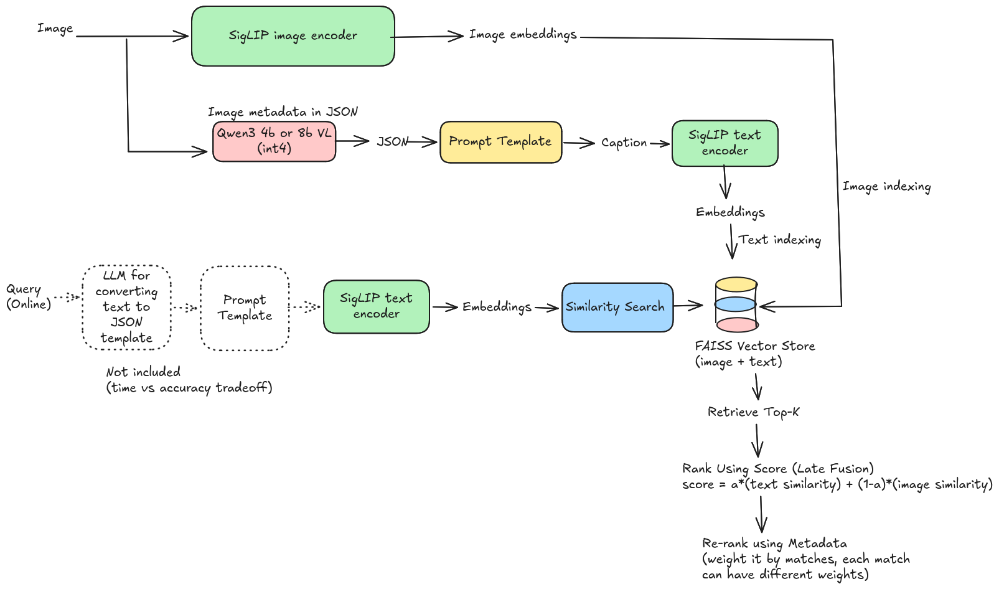
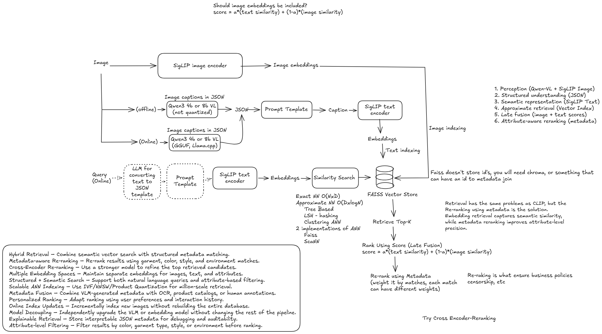

# Fashion Retrieval
Natural-language search over a fashion image database.

Powered by Qwen3-VL, SigLIP, and an unhealthy amount of FAISS.

## Usage

```bash
# Offline: caption + embed every image, then build both FAISS indexes.
python -m fashion_retrieval.indexer.index
python -m fashion_retrieval.indexer.index --caption-only    # just JSON + .npy (GPU)
python -m fashion_retrieval.indexer.index --build-only      # just FAISS (GPU-free)
python -m fashion_retrieval.indexer.index --limit 20        # first 20 images
```

After this, you may use `demo.ipynb`

```bash
# Online: search (a = fusion weight; a=1 text-only, a=0 image-only)
python -m fashion_retrieval.retriever.retrieve "professional business attire inside a modern office" -k 5 -a 0.5

# Add a new image end-to-end, then rebuild to make it searchable
python -m fashion_retrieval.indexer.ingest path/to/image.jpg
python -m fashion_retrieval.indexer.index --build-only
```

Notebooks: `vlm.ipynb` (offline driver) and `online_ingest.ipynb` (drop-folder demo) are thin
wrappers over this package; `retrieval_eval.ipynb` is the eval scratchpad.

# Demo

Try the image search in `demo.ipynb` - no indexing needed, the zip already has a prebuilt index. Three steps:

```bash
# 1. Install dependencies (tested on Python 3.11)
pip install -r requirement.txt

# 2. Download bigly_files.zip (Drive link below) and unzip it into data/
#you should now have data/index/, data/sampled_images/, data/qwen3_vl_metadata/, ...
unzip bigly_files.zip -d data/

# 3. Open the notebook and run the cells top-to-bottom
```

[Bigly_files.zip Drive link](https://drive.google.com/file/d/1NkqAM56hqsUvmvfEH0wbcgBtIM30LRCd/view?usp=sharing) holds the sampled dataset plus the Qwen-generated metadata and FAISS index.

Cell 1 loads the index, then each `demo("...")` cell renders a results grid.
Search runs on **CPU with no VLM** — the only model it pulls is SigLIP. The
live-ingest cells at the end additionally download Qwen3-VL, so skip those if you
just want to search. The demo has also been run over the evaluation queries (end
of the notebook).

## Approach

A **SigLIP two-tower, late-fusion** retriever with a metadata rerank:

1. **Perceive (offline):** a VLM captions each image into **structured JSON**
   (garments + colors + features + scene), and SigLIP's **image tower** embeds the pixels.
2. **Represent:** the JSON is synthesized into a sentence and embedded by SigLIP's
   **text tower**. Both towers share one latent space, so a text query is comparable to
   *both* caption vectors and image vectors.
3. **Retrieve (online):** the query is embedded once (text tower) and scored against
   **two FAISS indexes** — `score = a·text_sim + (1-a)·image_sim` (late fusion) — then a
   **metadata rerank** boosts attribute overlaps for precision.

Fusion is why coverage doesn't depend on the caption being complete: an image of a red tie
is retrievable via its image vector even if the caption missed the word "tie". The VLM is used
**only during indexing** — the online path is text-encoder + FAISS + rerank, no VLM/LLM.

## Architecture



**Offline (`indexer/`)** — build the indexes from images:

- Each image → **Qwen3-VL** → structured JSON (garments, colors, features, scene).
- Each image → **SigLIP image tower** → image vector.
- JSON → `attrs_to_text` → sentence → **SigLIP text tower** → caption vector.
- Persist to `text.faiss` + `image.faiss` + `records.jsonl`.

**Online (`retriever/`)** — answer a query:

- Query text → **SigLIP text tower** → query vector `q`.
- `q` vs `text.faiss` → `text_sim`; `q` vs `image.faiss` → `image_sim`.
- Fuse: `score = a·text_sim + (1-a)·image_sim` → top-100 candidates.
- **Metadata rerank** on the candidates → top-k results.

## Layout

| File | Role |
|------|------|
| `configs/config.py`     | All paths, model names, and knobs (one source of truth) |
| `indexer/caption.py`    | `Qwen3VLCaptioner`: image → structured-JSON metadata |
| `indexer/embed.py`      | `SiglipEncoder`: text **and** image towers off one model, cosine-normalized |
| `indexer/attributes.py` | `attrs_to_text` / `flat_attrs`: structured JSON → embeddable sentence + rerank dict |
| `indexer/storage.py`    | `VectorStore`: FAISS index + row-aligned JSONL records |
| `indexer/index.py`      | **Offline pipeline**: caption+embed all images → build both indexes |
| `indexer/ingest.py`     | **Ingestion pipeline**: `Ingestor` adds one image end-to-end (online) |
| `retriever/fusion.py`   | Late-fusion scoring over the two indexes |
| `retriever/rerank.py`   | Attribute-overlap boost on top of the fused score |
| `retriever/retrieve.py` | `FusionRetriever`: query → top-k (+ CLI) |
| `utils/io.py`           | Shared helpers: numbering, image save, metadata append, JSON-parse fallback |

## Models

| Role | Model | Notes |
|------|-------|-------|
| VLM captioner (offline) | `unsloth/Qwen3-VL-2B-Instruct-unsloth-bnb-4bit` | 4-bit, fits a 6 GB GPU |
| SigLIP encoder (offline + online, both towers) | `google/siglip2-base-patch16-224` | 768-d, shared text/image latent space, runs on CPU |

> **Critical:** use **`transformers<5`** (tested on 4.57) — the 4-bit `bitsandbytes`
> loading path breaks under transformers 5.x. See `requirement.txt`.


## A known Problem :(

Raw SigLIP text↔text cosines (~0.6) are larger in magnitude than text↔image cosines (~0.1), so
`a=0.5` is still text-leaning. Normalize each similarity per query (z-score / min-max / rank
fusion) before treating `a` as a literal 50/50 weight.

## Scalability

`IndexFlatIP` is exact and ideal for ~1k images. At ~1M+, swap to `IndexIVFFlat`/HNSW in
`storage.py::build_index` (one function, documented inline); the query path is unchanged.
Captioning/embedding are embarrassingly parallel; ingestion is incremental per image.


# Extra (my thought process on why this arch)
